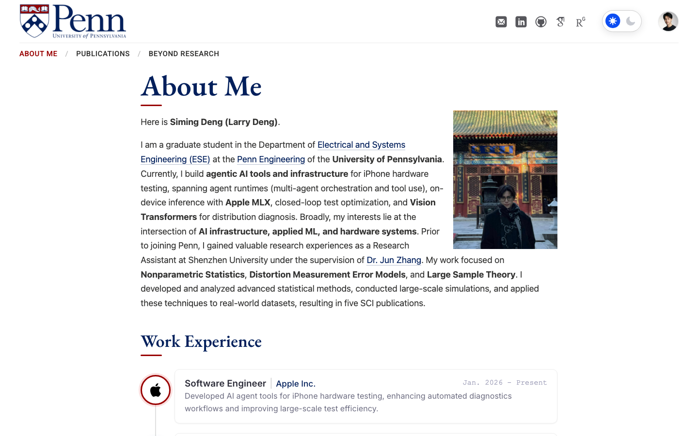
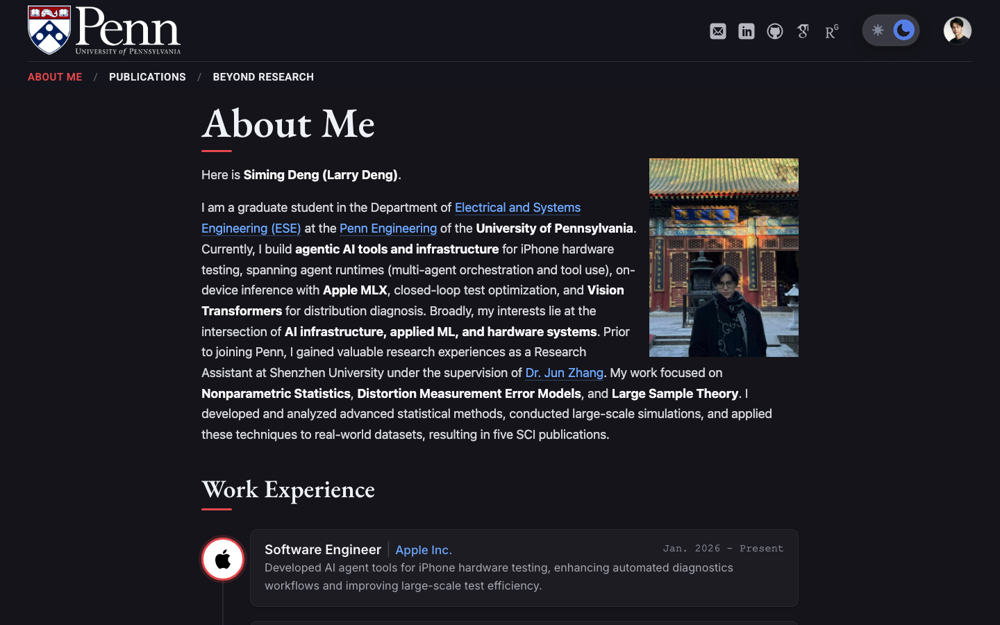
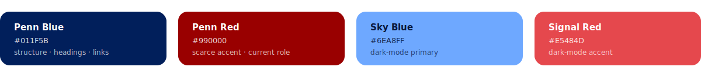
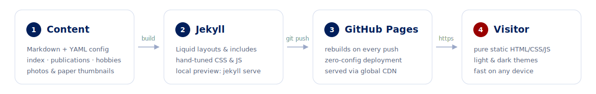

<div align="center">

<a href="https://larrysimingdeng.github.io">
  
</a>

<a href="https://larrysimingdeng.github.io"></a>


<a href="LICENSE"></a>

</div>

## Overview

This repository contains the source of [larrysimingdeng.github.io](https://larrysimingdeng.github.io), the personal website of **Siming Deng (Larry Deng)**, graduate student at the [Department of Electrical and Systems Engineering](https://www.ese.upenn.edu/), [Penn Engineering](https://www.seas.upenn.edu/), University of Pennsylvania. His work sits at the intersection of AI agents, AI infrastructure, ML systems, and statistics.

| Page | Route | Content |
|---|---|---|
| About Me | `/` | Bio and research focus, news grid, work-experience timeline |
| Publications | `/publications/` | Peer-reviewed papers with covers and links |
| Beyond Research | `/hobbies/` | Life outside the lab |

## Preview

<table>
  <tr>
    <td width="50%"></td>
    <td width="50%"></td>
  </tr>
  <tr>
    <td align="center"><sub>Light</sub></td>
    <td align="center"><sub>Dark</sub></td>
  </tr>
</table>

## Design

- **UPenn-style header.** Two-tier sticky header with a frosted-glass blur and an oversized Penn wordmark.
- **Dark mode.** One-click toggle that follows the system preference and is remembered across visits.
- **Living timeline.** Entries light up as they scroll into view; the current role carries a Penn-red pulse.
- **Scroll-reveal cards.** News and publication cards fade in as they enter the viewport.
- **Deliberate typography.** System sans for display, PT Serif for long-form reading.
- **Mobile-tuned.** Responsive layout with a compact fixed header and touch-friendly cards.
- **No frameworks.** Plain HTML, CSS and JavaScript on top of Jekyll.

The site uses the official Penn palette: Penn Blue for structure (headings, links, the timeline) and Penn Red as a scarce accent (the heading underline, the current-role pulse). Dark mode swaps in lighter tints of both to preserve contrast.



## Deployment

<picture>
  <source media="(prefers-color-scheme: dark)" srcset=".github/assets/pipeline-dark.svg">
  
</picture>

Edit Markdown, push to `main`, and GitHub Pages rebuilds and publishes the site, usually within a minute.

## Local development

Requires Ruby 3.3 (see `.ruby-version`) and Bundler.

```bash
git clone https://github.com/LarrySimingDeng/larrysimingdeng.github.io.git
cd larrysimingdeng.github.io

bundle install
bundle exec jekyll serve --livereload
# http://127.0.0.1:4000
```

> [!TIP]
> Comment out the `url:` field in `_config.yml` while previewing locally so absolute URLs resolve to `localhost` instead of production.

## Project structure

```
.
├── _config.yml        # site title, owner info, top navigation
├── _includes/         # head, footer and shared partials
├── _layouts/          # page template, theme toggle, timeline logic
├── assets/
│   ├── css/main.css   # palette, header, timeline, dark mode styles
│   └── js/            # interactions and vendor scripts
├── images/            # photos, logos, paper thumbnails
├── index.md           # About Me: bio, news, experience timeline
├── publications.md    # publication cards
└── hobbies.md         # Beyond Research
```

## Customization

Everything personal sits in a handful of files:

| What | Where |
|---|---|
| Name, avatar, email, social links | `_config.yml`, `owner:` section |
| Top navigation | `_config.yml`, `links:` section |
| Bio, news, experience timeline | `index.md` |
| Publications | `publications.md` |
| Photos and thumbnails | `images/` |
| Colors, typography, animations | `assets/css/main.css` |

## License

Code is released under the [MIT License](LICENSE). Site content (text, photos and publication material) © Siming Deng.
